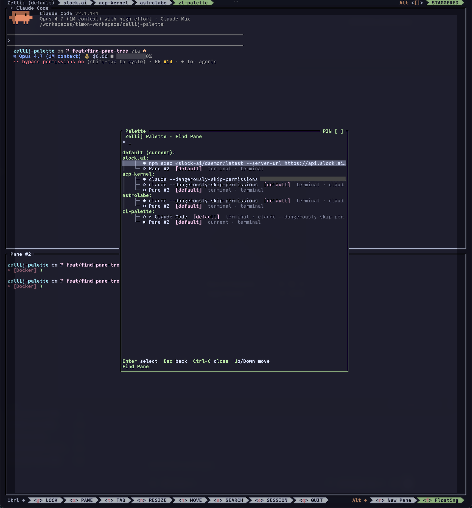

# zellij-palette

A Rust/WASM command palette for [Zellij][zellij], heavily inspired by
[`tmux-palette`][tmux-palette] by [@eduwass][eduwass]. The `:` palette shape,
fuzzy-match flow, category overlays, custom-palette config layout, and
shell-backed palette sources are all his design — this project is a port of
those ideas onto Zellij's plugin model.



> **Heads up — this is mostly "AI slop."**
> The implementation is overwhelmingly AI-generated ("vibe-coded"). It works
> for the author's daily Zellij use, but expect rough edges, inconsistent
> design choices, and the occasional WTF. Bug reports welcome; promises of
> polish are not.

It opens as a Zellij plugin pane, lets you fuzzy-search actions, and dispatches pane/tab/session/theme commands without leaving the keyboard.

[zellij]: https://zellij.dev
[tmux-palette]: https://github.com/eduwass/tmux-palette
[eduwass]: https://github.com/eduwass

## Current feature set

- Searchable `Commands` palette with pane, tab, session, and appearance actions
- `Find Pane` palette that jumps across sessions, tabs, and panes
- `Move Pane` palette that sends the caller pane into another tab or a new tab
- `Themes` palette grouped into **Theme Mode** (toggle / use dark / use light), **Built-in Themes** (the 41 themes Zellij 0.44 ships), and **User Themes** (any `*.kdl` under the directory passed via the `theme_dir` plugin parameter). A same-named user theme shadows the built-in entry.
- Custom commands from `~/.config/zellij-palette/commands.toml`
- Custom palettes from `~/.config/zellij-palette/palettes/*.toml`
- `hidden.toml`, `shortcuts.toml`, and `aliases.toml` overlays
- Files can be authored as TOML, YAML, or JSON; when several variants of the same name exist, TOML wins, then YAML, then JSON
- Category-aware custom palettes via `from_category` (`fromCategory` still works)
- Shell-backed palette sources that emit JSON items or plain lines with optional icon metadata
- Focused launch bindings for a built-in palette, a custom palette, or a single category

## Install

The example below loads the plugin directly from the GitHub release
artifact — no manual download needed. Browse all versions at
<https://github.com/timonwong/zellij-palette/releases>.

### Build from source

If you'd rather build locally:

```bash
mise install
mise run build
```

The plugin artifact is:

```bash
target/wasm32-wasip1/release/zellij-palette.wasm
```

Common tasks live in [`mise.toml`](mise.toml):

```bash
mise run test
mise run fmt
mise run clippy
mise run install
```

The Rust toolchain, `wasm32-wasip1` target, `rustfmt`, and `clippy`
are all declared in `mise.toml`, so `mise install` prepares the full
repo toolchain.

If your local Rust install still points at an older repo toolchain, run
`mise install -f rust` once so `mise` can reconcile the target and
components onto the updated toolchain.

## Bind It In Zellij

Add a keybinding that launches the plugin as a floating pane.

Example snippet:

```kdl
plugins {
    // Zellij downloads remote plugins on first use and caches them by
    // URL hash under $ZELLIJ_CACHE_DIR (defaults to ~/.cache/zellij/).
    // `latest` is fetched ONCE and reused thereafter — Zellij does not
    // re-resolve the redirect on upgrade. To pull a new release: pin
    // to a versioned URL (.../releases/download/v0.1.0/zellij-palette.wasm)
    // or clear the matching entry under $ZELLIJ_CACHE_DIR.
    zellij-palette location="https://github.com/timonwong/zellij-palette/releases/latest/download/zellij-palette.wasm"
    zellij-palette-themes location="https://github.com/timonwong/zellij-palette/releases/latest/download/zellij-palette.wasm" {
        palette "themes"
        theme_dir "~/.config/zellij/themes"
    }
    zellij-palette-tools location="https://github.com/timonwong/zellij-palette/releases/latest/download/zellij-palette.wasm" {
        category "Tools"
    }
}

keybinds {
    // `shared` fires in EVERY input mode (Normal, Pane, Tab, Resize,
    // Move, Scroll, Search, Locked, ...). Right for a global launcher
    // you want reachable from anywhere — including Locked.
    shared {
        bind "Ctrl Shift p" {
            LaunchOrFocusPlugin "zellij-palette" {
                floating true
                move_to_focused_tab true
            }
        }
    }

    // `normal` only fires in Normal mode (Zellij's default prompt).
    // Use it when a key would clash with submodes.
    normal {
        bind "Alt t" {
            LaunchOrFocusPlugin "zellij-palette-themes" {
                floating true
                move_to_focused_tab true
            }
        }
        bind "Alt o" {
            LaunchOrFocusPlugin "zellij-palette-tools" {
                floating true
                move_to_focused_tab true
            }
        }
    }
}
```

The plugin reads three launch keys from the alias configuration block:

- `palette`: `commands`, `find-pane`, `move-pane`, `sessions`, `themes`, or a custom palette filename
- `category`: filters the root commands palette to one category such as `Tools`
- `theme_dir`: path to a directory of user-defined `*.kdl` theme files. When set, those names appear under the **User Themes** group in the Themes palette and shadow same-named built-ins. Accepts absolute paths or `~/...` (expanded against `$HOME` from the Zellij session). When unset, only the 41 built-in themes are listed.

There is a ready-to-edit example in [examples/config.kdl](examples/config.kdl).

## Runtime behavior

- `Esc` clears the query first, then goes back one palette level, then closes the plugin
- `Ctrl-C` follows the same close path
- `Enter` runs the highlighted action
- `Up` / `Down` and `Ctrl-P` / `Ctrl-N` move selection
- Mouse wheel and hover update selection

The plugin tracks the caller pane through Zellij's pane history, so actions such as `Move Pane`, `Toggle Fullscreen`, `Float / Embed Pane`, and `Close Pane` target the pane that was focused before the palette opened.

### Theme switching

Picking a theme dispatches `reconfigure("theme \"<name>\"", false)` against the live Zellij session. The change is immediate — no restart, no resurrect — and is *not* persisted to `~/.config/zellij/config.kdl`. Restarting Zellij brings back whatever theme `config.kdl` declares.

The built-in theme list is hard-coded to match the 41 themes Zellij 0.44 bakes into its binary via `include_dir!`; the zellij-tile 0.44 SDK does not expose an API to enumerate them at runtime. User themes are scanned from whatever directory the `theme_dir` plugin parameter points at (see the launch-keys list above) — the plugin does not try to mirror Zellij's `ZELLIJ_CONFIG_DIR` / `theme_dir` config / XDG-fallback resolution, since that would require parsing `config.kdl`. Pass the path explicitly. User entries shadow same-named built-ins.

`Toggle Dark / Light`, `Use Dark Theme`, and `Use Light Theme` map to Zellij's real `Action::ToggleTheme`, `Action::SetDarkTheme`, and `Action::SetLightTheme` — but those only do something visible when `theme_dark` *and* `theme_light` are both set in your Zellij config. Without that pair, they silently no-op.

## User config

Config lives under:

```text
~/.config/zellij-palette/
```

Each file can be authored as TOML, YAML, or JSON. The loader picks the
extension by priority **TOML > YAML > JSON** and uses the first variant
that exists. If a higher-priority file is present but fails to parse,
the loader does *not* silently fall through to a lower-priority sibling.
Examples below use TOML; the same data deserializes from YAML and JSON.

### Extra commands

Path:

```text
~/.config/zellij-palette/commands.toml
```

Example:

```toml
[[commands]]
title = "lazygit"
description = "open lazygit in a floating command pane"
category = "Tools"
icon = "󰊢"
aliases = ["git", "lg"]
shortcut = "Ctrl-G"
action = { popup = "lazygit", width = "80%", height = "80%", borderless = true }

[[commands]]
title = "Reload shell rc"
group = "Tools"
action = { shell = "exec $SHELL -lc 'source ~/.zshrc'" }
```

JSON equivalent (`commands.json`) — a top-level array of the same items:

```json
[
  {
    "title": "lazygit",
    "category": "Tools",
    "action": { "popup": "lazygit", "width": "80%", "height": "80%", "borderless": true }
  }
]
```

Supported item fields:

- `title`
- `description`
- `category` or `group`
- `aliases`
- `shortcut`
- `icon`
- `icon_color` (alias: `iconColor`)
- popup action sizing keys: `x`, `y`, `width`, `height`, `pinned`, `borderless`
- `action`

`group` stays as a compatibility alias for `category`.

### Hidden items

Path:

```text
~/.config/zellij-palette/hidden.toml
```

Example:

```toml
hidden = ["Previous Tab", "Detach Session"]
```

JSON equivalent — a top-level array:

```json
["Previous Tab", "Detach Session"]
```

### Shortcut labels

Path:

```text
~/.config/zellij-palette/shortcuts.toml
```

Example:

```toml
"Find Pane" = "Ctrl-F"
"lazygit" = "Ctrl-G"
```

### Visible alias chips

Path:

```text
~/.config/zellij-palette/aliases.toml
```

Example:

```toml
"Find Pane" = ["locator"]
"Switch Theme..." = ["appearance"]
```

### Custom palettes

Path:

```text
~/.config/zellij-palette/palettes/<name>.toml
```

Example:

```toml
title = "GitHub PRs"
from_category = "Tools"
icon = "󰘬"
icon_color = "#58a6ff"
command = "gh pr list --limit 20 --json number,title --jq '.[] | \"#\\(.number) \\(.title)\"'"
action = { popup = "open {}" }
```

Supported item actions (shown as TOML inline tables; in JSON wrap the
same keys in `{...}` objects):

- `{ palette = "themes" }`
- `{ palette = "find-pane" }`
- `{ palette = "<custom-name>" }`
- `{ shell = "..." }`
- `{ popup = "..." }`
- `{ popup = "...", x = "10%", y = "10%", width = "80%", height = "80%", pinned = true, borderless = true }`
- `{ theme = "dark" }`
- `{ theme = "light" }`
- `{ theme = "toggle" }`
- `{ theme = "<theme-name>" }`

For shell-backed palette sources:

- If the command prints a JSON array, each entry should match the same item schema as `commands.toml`
- If the command prints plain lines, pair it with an `action` template and use `{}` as the selected line placeholder
- Plain-line mode also accepts tab-separated icon fields:
  - `<title>`
  - `<icon>\t<title>`
  - `<icon>\t<icon_color>\t<title>`

Custom palette keys (snake_case shown; camelCase variants
`fromCategory`, `fromGroup`, `iconColor`, `emptyText` are accepted for
backward compatibility):

- `title`
- `from`
- `from_category`
- `from_group`
- `command`
- `action`
- `icon`
- `icon_color`
- `grouped`
- `empty_text`
- `items`

## Smoke test

1. Copy [examples/config.kdl](examples/config.kdl) into place — it loads
   the plugin straight from the GitHub release, so no edits are needed.
2. Copy any wanted example TOML files from [examples/](examples/) into `~/.config/zellij-palette/`.
3. Start Zellij with that config.
4. Press `Ctrl-Shift-p`, `Alt-t`, and `Alt-o`.

To smoke-test a local build instead of the release artifact, use
[examples/smoke-layout.kdl](examples/smoke-layout.kdl) — it still expects
`__WASM__` to be substituted with the absolute path of your built
`target/wasm32-wasip1/release/zellij-palette.wasm`.
